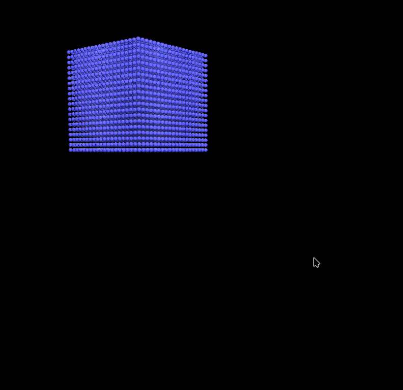

# I_Fluid

## Introduction

`I_render` is used to learn fluid simulation.

## Learning Process

### Wave 1D

An easy 1D wave simulator built by Taichi.

### Navier-Stokes Equations

The equation is as following:
$$
\begin{aligned}
&\mathbf{a}=\mathbf{g}-\frac{\nabla p}\rho+\mathbf{\mu}\nabla^2\mathbf{v}\\
&\nabla\cdot\mathbf{v}=0,
\end{aligned}
$$

### Particle System

- Conventional particle system realized by SPH has amount of loss. User should tuning the parameters hardly. And the tuning process is such **STUPID**.
- **PCISPH** solves this problem, giving a better results.
  - PCISPH minimize the density error.
  - In each iteraton, PCISPH calculates gravity and viscosity firstly. And then, PCISPH estimates the new density of the particle.
  - PCISPH will use the new density to calculate pressure.
  - Iterations: calculate the pressure gradient and update the position, density and pressure. When the density is closed to the target density, break the loop.
- An easy demo:
  

### Grid System
